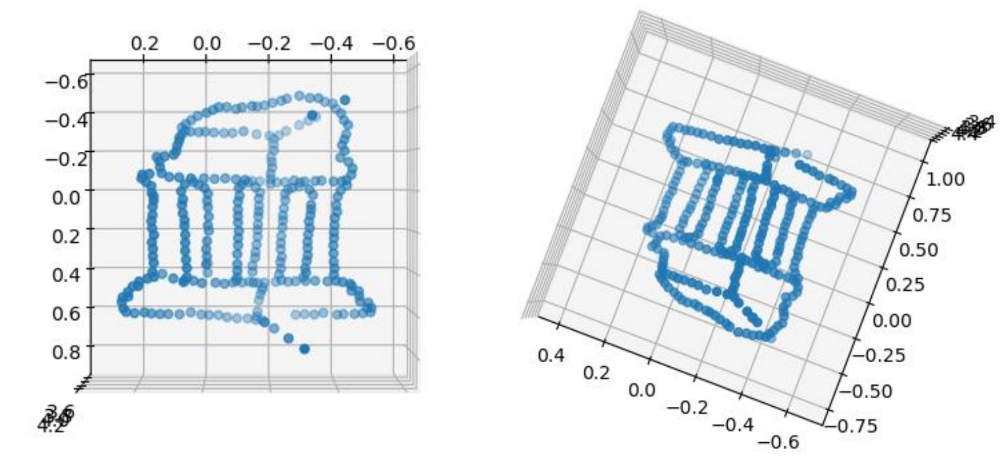
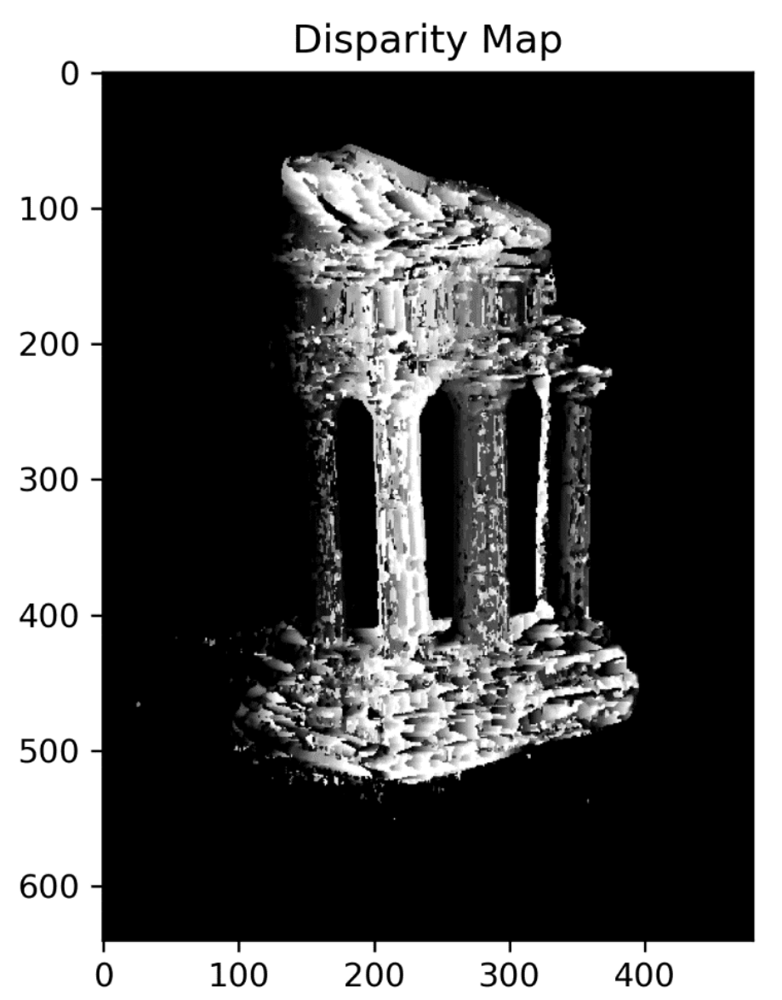
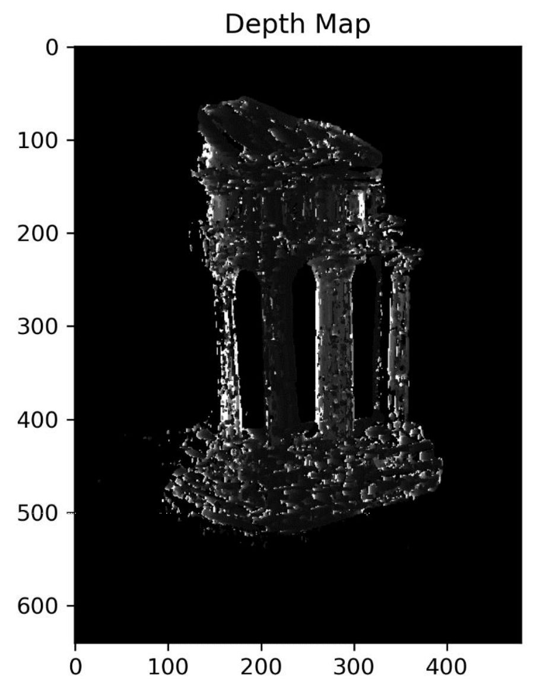

# 3D Reconstruction

## 🚀 Overview
This project focuses on 3D reconstruction using computer vision techniques. The goal is to reconstruct a 3D structure from multiple 2D images using fundamental and essential matrices, triangulation, rectification, and depth estimation. The project is divided into four main parts:

1. **Sparse Reconstruction** - Estimating fundamental and essential matrices, finding epipolar correspondences, and triangulating 3D points.
2. **Dense Reconstruction** - Rectifying images, computing disparity maps, and generating depth maps.
3. **Pose Estimation** - Estimating intrinsic and extrinsic camera parameters from 2D-3D correspondences.
4. **Multi-View Stereo** - Using multiple images to compute a depth map and generate a 3D point cloud.

## 🔧 Implementation Details

### 1. Sparse Reconstruction
- **Fundamental Matrix Estimation**: Implemented using the eight-point algorithm with normalization.
- **Epipolar Correspondences**: Used the epipolar constraint to refine matches, applying Euclidean distance to compare similarity.
- **Essential Matrix Computation**: Derived from the fundamental matrix and intrinsic camera matrices.
- **Triangulation**: Reconstructed 3D points from 2D correspondences using projection matrices.

### 2. Dense Reconstruction
- **Image Rectification**: Transformed image pairs to align epipolar lines horizontally.
- **Disparity Map**: Computed using the sum of squared differences (SSD) between patches.
- **Depth Map**: Derived from the disparity map using camera parameters.

### 3. Pose Estimation
- **Camera Matrix Estimation**: Used Direct Linear Transform (DLT) for projection matrix computation.
- **Intrinsic & Extrinsic Parameter Extraction**: Decomposed the camera matrix using QR decomposition.

### 4. Multi-View Stereo
- **Depth Map Computation**: Used multiple views for accurate depth estimation.
- **Point Cloud Generation**: Saved depth maps as 3D point clouds in OBJ format for visualization in MeshLab.

## 🎯 Results
- **Final Temple Reconstruction**:
  
- **Disparity Map**:
  
- **Depth Map**:
  

## Challenges & Observations
- **Epipolar Matching Issues**: Some points in low-texture areas were difficult to match accurately.
- **Reprojection Error**: The final re-projection error was **0.5201 pixels**, indicating high accuracy.
- **Pose Estimation Performance**: Achieved **near-zero error** for clean data, but some deviations for noisy data.
- **Multi-View Stereo**: Significantly improved depth estimation compared to two-view reconstruction.

## 📚 Acknowledgments
This project was developed as part of CMPT412 at SFU.
